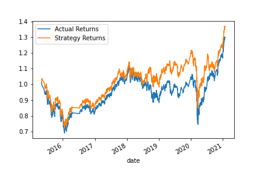
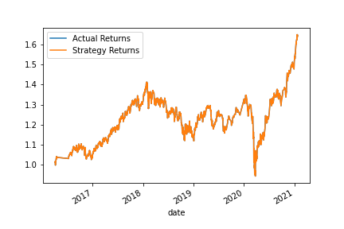
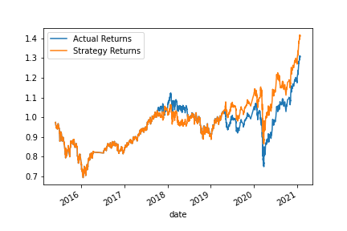

# Stock_Trading_w-_Machine_Learning
An evaluation of machine learning approaches to automated stock trading.

---
# The Baseline Model
 
The baseline model is a support vector machine deployed as a binary classifier to predict a trading signal (long trade/short trade). In the training data, the trading signal is set to 1 if the hourly return is zero or positive and set to -1 if the hourly return is negative. The predictors are simple moving average series of hourly returns (percent change in close price), including a short window (4 hours) and a long window (100 hours). The model is backtested by calculating "Strategy Returns", assuming the trader responds to the signal produced in the prior hour to execute a long trade when the signal is positive and a short sale when the signal is negative.

The performance of the baseline model is lackluster. The model is particularly weak at detecting the short trade signal. It starts to perform better from 2019 forward, a pattern that may be related to higher volatility that time period.

What follows are examples of various parameters tested with the baseline model and a synopsis of the back-testing results.

## Tuning the Baseline Model
### Length of Time range used to train model

* 1 month

* 6 months

* 12 months

A longer training window produced a better overall performance (particularly in a bull market), but the shortest training window (1 month) produced a model that more consistently outperformed the index returns. This may indicate that longer training periods are over-fitting the model.

### Moving average window for predictors

* SMA Fast adjusted up from 4 to 50

* SMA Slow adjusted down from 100 to 40

Expanding the moving average window of the fast predictor did not improve results. Reducing the window for the slow predictor  from 100 to 40 improved the recall and F1 score for the short trade signal.

## Tuned Baseline Model

After testing multiple combinations of parameters, the conclusion is that the baseline model using 1 month of training data and the 60 simple moving average for the slow predictor results in a model that beats the market most consistently across the window of time used to backtest the model. This model also has higher recall (albeit still very weak at 9%) for the short trade. 

